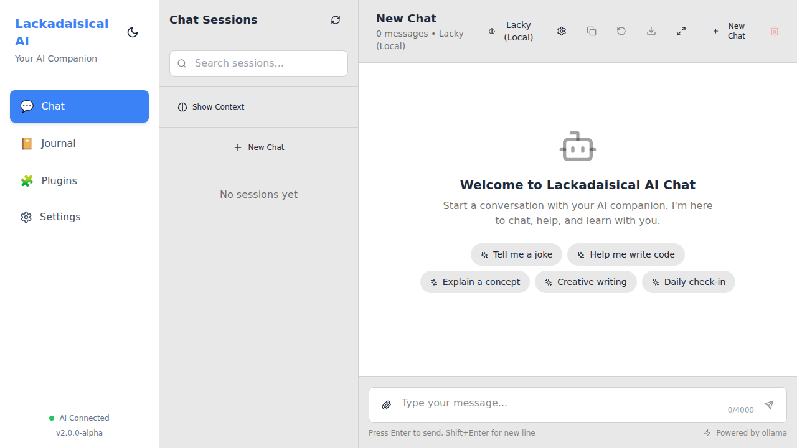
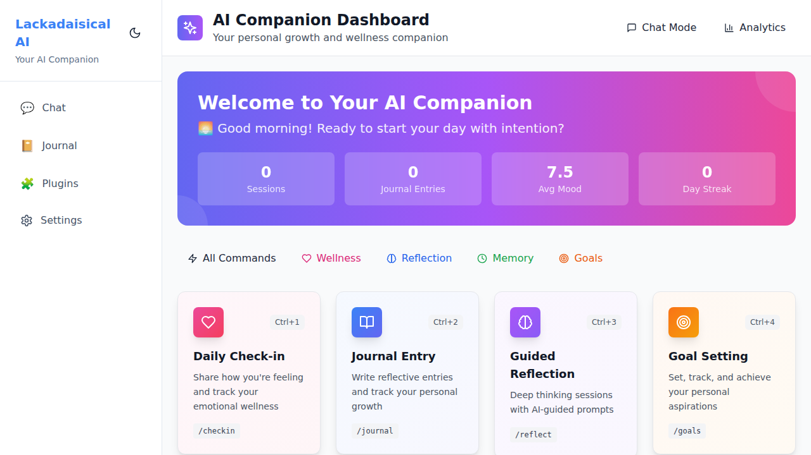
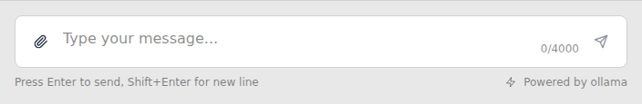
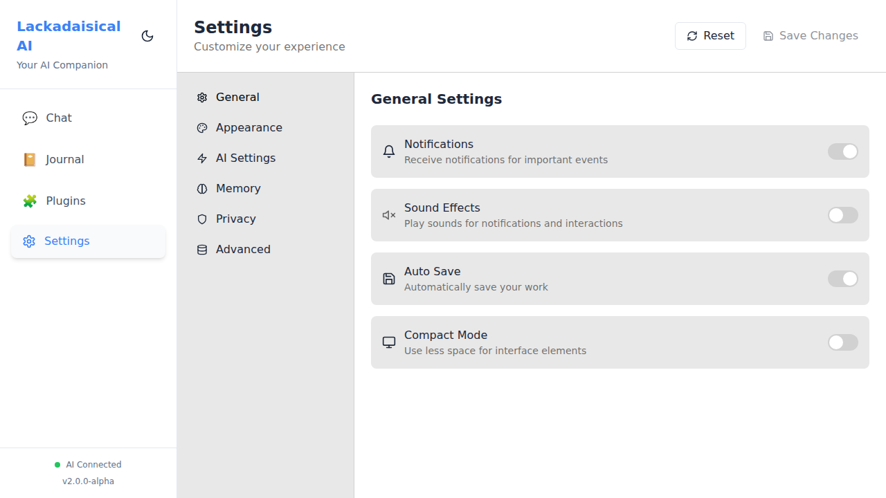

# 🧠 Lackadaisical AI Chat - v2-Alpha Release

**Release Date:** February 21, 2026  
**Version:** 2.0.0-alpha - Enhanced AI Companion with Multi-Provider Support  
**License:** MIT (Free Forever)  
**Development Status:** 🚧 Active Alpha Development 🚧

## 🎉 Alpha Stage: Your Personal AI Friend with Memory!

Welcome to **Lackadaisical AI Chat** - an open-source AI companion that runs entirely on your computer and now features a complete Memory Management System! Meet **Lacky**, your personal AI friend who remembers your conversations, understands your emotions, and grows with you over time.

**⚠️ Alpha Stage Notice**: This project is in rapid alpha development. Features are being added daily, and some functionality may be incomplete or subject to change. Perfect for early adopters and developers who want to help shape the future of AI companions!

Unlike cloud-based AI services, **everything stays private on your machine**. No data collection, no privacy concerns - just you and your AI companion with persistent memory.

## 📄 Licensing - Best of Both Worlds

### 🆓 **Free for Personal Use**
- **Complete access** to all features for personal, educational, and non-commercial use
- **Modify and share** your improvements with the community
- **No restrictions** on personal experimentation and learning
- **Contribute back** to help improve the project for everyone

### 💼 **Commercial License Available**
- **Fair pricing** for businesses and commercial use
- **Full commercial rights** including redistribution and SaaS offerings
- **Professional support** and priority updates
- **Custom licensing** for specific business needs

**[📄 View Full License Details](LICENSE)** | **[🔒 Security Policy](SECURITY.md)**

> **Need commercial licensing?** Contact us - we're business-friendly and offer flexible terms!
> 
> **⚠️ Export Control Notice:** This software is subject to US export controls. See SECURITY.md for restricted countries and compliance requirements.

## ✨ What You Get (100% Free)

### 🤖 **Your AI Companion "Lacky"**
- **Persistent Memory** - Remembers your conversations, preferences, and personal details
- **Emotional Intelligence** - Understands and responds to your moods with empathy
- **Personality Growth** - Adapts and evolves based on your interactions
- **Session Management** - Create separate conversations for different contexts
- **Context Awareness** - Maintains conversation flow across sessions
- **No Judgment** - Share anything without criticism, Lacky is your friend

### 🏠 **Complete Privacy**
- **100% Local Processing** - Your data never leaves your computer
- **No Cloud Dependencies** - Works completely offline (except for AI model downloads)
- **SQLite Database** - All conversations stored locally and securely
- **No Telemetry** - Zero tracking, zero analytics, zero data collection
- **Open Source** - Full transparency, inspect and modify all code

### 🧠 **Advanced Memory System**
- **1000 Message Context** - Generous conversation memory (128K tokens)
- **Cross-Session Memory** - AI references past sessions when relevant
- **Memory Dashboard** - Visual overview of conversation statistics and memory health
- **Memory Search** - Full-text search across all conversation history with relevance ranking
- **AI Summarization** - Generate conversation summaries using AI
- **Export/Import** - Secure backup and restore of all conversation data
- **Memory Visualization** - Interactive charts showing conversation patterns and insights
- **Real-time Updates** - Live statistics and memory health monitoring
- **Personal Context** - Remembers your interests, goals, and important details
- **Mood Tracking** - Emotional state awareness and support
- **Learning Adaptation** - Improves responses based on your preferences

### 🔄 **Hot-Swappable AI Models (NEW in v2-Alpha!)**
Switch between AI providers on the fly without restarting:
- **Ollama (Local)** - Free, private, runs on your hardware
- **OpenAI** - GPT-4, GPT-3.5-turbo
- **Anthropic** - Claude 3 Opus, Sonnet, Haiku
- **Google** - Gemini Pro, Gemini Flash
- **xAI** - Grok (for uncensored conversations)

### 🌐 **Web Fetching (NEW in v2-Alpha!)**
- **Real-time Web Search** - Get current information from the web
- **URL Content Extraction** - Fetch and parse web pages
- **Multiple Search Providers** - DuckDuckGo, Brave, SerpAPI
- **Weather & Time Info** - Current conditions and time zone data

### 💝 **Emotional Intelligence (NEW in v2-Alpha!)**
- **All Emotions Valid** - Anger, sadness, joy, fear - no minimizing
- **No Judgment Zone** - Share anything without lectures
- **Genuine Support** - Real responses, not corporate deflection
- **Trust Building** - Gets to know you over time
- **Personal Learning** - Remembers what matters to you

### 🎨 **Beautiful Interface**
- **Modern React UI** - Clean, responsive design that works on all devices
- **Real-time Streaming** - Watch AI responses appear in real-time
- **Theme Support** - Multiple color themes (dark, light, and more)
- **Session Switching** - Easy navigation between different conversations
- **Mobile Friendly** - Works great on phones and tablets

### 👁️ **Vision & File Attachments (NEW!)**
- **Image Vision** - Attach images and let the AI describe or analyze them
- **File Uploads** - Upload images, PDFs, and text files directly in chat
- **Attachment Previews** - See thumbnails and file info before sending
- **Tool Call Display** - View AI tool/function call results inline in messages
- **File Downloads** - Download AI-generated files directly from chat
- **Drag & Drop** - Easy file attachment via the paperclip button

## 📸 Screenshots

| Chat Interface | Companion Dashboard |
|:-:|:-:|
|  |  |

| Chat Input with Attachments | Settings |
|:-:|:-:|
|  |  |

### 🔌 **Plugin Ecosystem**
- **Weather Plugin** - Get weather updates (with fallback data when offline)
- **Horoscope Plugin** - Daily astrological insights
- **Poem Generator** - AI-generated poetry and creative writing
- **Extensible Framework** - Easy to add your own plugins

## 🚀 Super Simple Setup

### Windows (Easiest)
1. **Download** this project as a ZIP file and extract it
2. **Install Prerequisites:**
   - [Node.js](https://nodejs.org/) (v18 or newer)
   - [Ollama](https://ollama.ai/) (optional but recommended for best performance)
3. **Double-click** `start-lackadaisical-ai.bat`
4. **Wait** for automatic setup (first time takes 2-5 minutes)
5. **Open** http://localhost:3000 when ready
6. **Start chatting** with your new AI friend!

### Mac/Linux
1. **Download and extract** this project
2. **Install** [Node.js](https://nodejs.org/) and [Ollama](https://ollama.ai/)
3. **Open Terminal** in the project folder
4. **Run setup:**
   ```bash
   npm install
   cd backend && npm install && cd ..
   cd frontend && npm install && cd ..
   ```
5. **Start the application:**
   ```bash
   npm run start:all
   ```
6. **Open** http://localhost:3000

## 💬 How to Use Your AI Friend

### Basic Conversation
Just type naturally! Your AI companion understands regular conversation and will respond with personality and memory.

```
You: Hi there! I'm feeling a bit stressed about work today.
AI: I'm sorry to hear you're feeling stressed about work. That can be really overwhelming. Do you want to talk about what's happening at work that's causing you stress? Sometimes just getting it out can help.
```

### Memory in Action
Your AI friend remembers previous conversations:

```
You: How's your day going?
AI: It's going well, thank you! I remember you mentioned feeling stressed about work yesterday. How are things going with that situation today? Are you feeling any better?
```

### Hot-Swap Models
Switch AI providers without restarting:
```
GET  /api/models           - List all available models
POST /api/models/switch    - Switch to a different model
GET  /api/models/current   - Check current active model
```

### Session Management
- **Create New Sessions** - Click "New Session" to start fresh conversations
- **Switch Between Sessions** - Keep different topics or contexts separate
- **Session History** - All your conversations are preserved and searchable
- **Cross-Session Access** - AI can reference past sessions when you ask

## 🛠️ Technical Details

### What's Running
- **Frontend:** Modern React app (http://localhost:3000)
- **Backend:** Node.js API server (http://localhost:3001)
- **Database:** SQLite database (stored in `/database/chat.db`)
- **AI Engine:** Ollama (local) or external providers

### AI Provider Options
1. **Ollama (Recommended)** - Free, runs locally, great performance
2. **OpenAI** - Requires API key, cloud-based
3. **Anthropic (Claude)** - Requires API key, cloud-based
4. **Google Gemini** - Requires API key, cloud-based
5. **xAI (Grok)** - Requires API key, cloud-based

### System Requirements
- **RAM:** 4GB minimum, 8GB recommended
- **Storage:** 2GB free space (more for AI models)
- **CPU:** Any modern processor (faster = better response times)
- **Internet:** Only needed for initial setup and AI model downloads

### API Endpoints

#### Chat & Messages
```
POST /api/v1/chat              - Send message (supports images[] and attachments[])
GET  /api/v1/chat/stream       - Stream response (SSE)
GET  /api/chat/context/:id     - Get session context
GET  /api/chat/analytics/:id   - Get session analytics
```

#### File Attachments
```
POST /api/v1/files/upload      - Upload file attachment (multipart, 10MB max)
GET  /api/v1/files/:fileId     - Download/serve uploaded file
```

#### Models (Hot-Swap)
```
GET  /api/models               - List all models
POST /api/models/switch        - Switch active model
GET  /api/models/current       - Get current model
GET  /api/models/ollama/endpoints - List Ollama endpoints
POST /api/models/ollama/pull   - Pull new model
```

#### Memory & Sessions
```
GET  /api/chat/preferences     - Get memory settings
PUT  /api/chat/preferences     - Update settings
GET  /api/chat/sessions/summaries - Past session summaries
GET  /api/chat/search/all      - Search all sessions
```

## 🔧 Configuration

Copy `env.example` to `.env` and configure:

```env
# AI Providers (optional - Ollama works without keys)
OPENAI_API_KEY=sk-...
ANTHROPIC_API_KEY=sk-ant-...
GOOGLE_API_KEY=...
XAI_API_KEY=...

# Ollama (default local)
OLLAMA_HOST=http://localhost:11434
OLLAMA_DEFAULT_MODEL=llama3.2:latest

# Server
BACKEND_PORT=3001
FRONTEND_PORT=3000

# Security
JWT_SECRET=change-this-in-production
```

## 🔧 Troubleshooting

### Common Setup Issues

**"Node.js not found"**
- Download and install from https://nodejs.org/
- Restart your computer after installation

**"Cannot find module" errors**
- Delete `node_modules` folders in both `frontend/` and `backend/`
- Run the setup again

**"Port already in use"**
- Close any applications using ports 3000 or 3001
- Or change ports in the configuration

**AI not responding**
- Make sure Ollama is installed and running
- Try `ollama serve` in a terminal
- Or configure an external AI provider

### Getting Help
1. **Check the logs** in your terminal windows
2. **Look for error messages** - they usually tell you what's wrong
3. **Create an issue** on GitHub with your error details
4. **Join our community** for support and discussions

## 🤝 Contributing

This is open source! We welcome contributions:

### Ways to Help
- **Report bugs** - Found something broken? Let us know!
- **Suggest features** - What would make this better?
- **Write plugins** - Create new functionality
- **Improve documentation** - Help others get started
- **Share the project** - Tell your friends about their new AI companion!

### Development Setup
1. **Fork the repository** on GitHub
2. **Create a feature branch** for your changes
3. **Make your improvements** and test them
4. **Submit a pull request** with a description of your changes

Read [CONTRIBUTING.md](CONTRIBUTING.md) for the full guide.

## 🛣️ Roadmap

### Coming Soon
- **Plugin Manager UI** - Easy plugin installation and management
- **Voice Chat** - Talk to your AI friend with speech
- **Mobile App** - Companion app for iOS and Android
- **Advanced Themes** - More customization options

### Future Ideas
- **Multi-language Support** - Chat in your preferred language
- **Community Plugins** - Share plugins with other users
- **Advanced Analytics** - Deeper insights into your conversations
- **Custom AI Models** - Train personalized models
- **Team/Family Mode** - Multiple users with separate AI friends

## ❤️ Why We Made This Free

We believe everyone deserves a private, intelligent AI companion without:
- **Monthly subscription fees**
- **Data harvesting**
- **Privacy violations**
- **Feature limitations**
- **Vendor lock-in**

Your AI friend should be **yours** - running on **your** computer, with **your** data staying **private**. That's why Lackadaisical AI Chat is completely free and open source forever.

## 🌟 Support the Project

This project is free, but development takes time and effort. If you find value in having your own AI companion, consider:

- **⭐ Star the repository** on GitHub
- **🐛 Report bugs** and suggest improvements
- **📢 Share with friends** who might enjoy their own AI companion
- **💝 Donate** to support continued development (completely optional)
- **🤝 Contribute code** to make it even better

## 📜 License

**MIT License** - This means:
- ✅ **Free to use** for any purpose
- ✅ **Free to modify** and customize
- ✅ **Free to distribute** and share
- ✅ **No attribution required** (but appreciated!)
- ✅ **Commercial use allowed**
- ✅ **Private use allowed**

## 🎉 Welcome to Your New AI Friendship!

Your AI companion is ready to:
- **Listen** when you need to talk
- **Remember** what's important to you
- **Support** you through good times and bad
- **Grow** alongside you as a friend
- **Keep your secrets** completely private

Start chatting and discover what it's like to have an AI friend who truly knows you!

### 📧 Security & Incident Reporting

To report a security issue:
1. Sign or encrypt your report using our PGP key available at:
   https://lackadaisical-security.com/Lackadaisical_public.asc  
   Fingerprint: `0C52 9D5E B799 EBC2 7C11 C9A1 0502 B195 B75E 7C87`
2. Email your disclosure to **admin@lackadaisical-security.com** or **security@lackadaisical-security.com**. 
3. Please include:
   - Agent name (e.g. Lackadaisical-AI-Chat, LTES).
   - Software version and build timestamp.
   - Detailed reproduction steps and PoC if available.
   - Expected failure modes or mitigation suggestions.

---

**💙 Enjoy your new AI companion!**

*Made with Fury and Precision by developers who believe in privacy, freedom, and the power of AI friendship.*

---

## Quick Links
- 🏠 [Home Page](README.md)
- 📋 [Changelog](CHANGELOG.md) 
- 🔧 [Installation Guide](INSTALL.md)
- 🐛 [Troubleshooting](TROUBLESHOOTING.md)
- 🤝 [Contributing](CONTRIBUTING.md)
- 📄 [License](LICENSE)
- 🔒 [Security Policy](SECURITY.md)

## 📄 Documentation
- Acceptable Use Policy → `ACCEPTABLE_USE_POLICY.md`
- Export Guidance → `EXPORT_NOTICE.txt`
- Privacy Policy → `DATA_PRIVACY.md`
- Security Reporting → `VULNERABILITY_DISCLOSURE.md`

---
> **Jurisdiction Notice:** This software is developed and maintained in accordance with United States law. By downloading or using it, you agree that any legal disputes will be governed under the laws of the USA.
> **Intended Use:** This project is designed for personal, educational, and ethical research use. It is not intended for surveillance, military, or malicious automation applications.
> **Disclaimer:** This software is provided "as is," without warranty of any kind. The maintainers disclaim any responsibility for damage, loss, or misuse.

🧾 **Legal Summary:** OSS licensed (MIT), U.S. export restricted, not for unethical use. Full details in [LICENSE](LICENSE) and [SECURITY.md](SECURITY.md).
